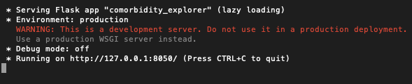

# Comorbidity Explorer
## A Predictive and Graphical Tool for Exploring Health Condition Relationships

*Please note, this repository contains a large language model (150MB) and requires [Git LFS](https://git-lfs.github.com/) to fully clone*
*You are, of course, free to build your own model using the tools in this repo!*

**You may use this application, no install required, by visiting the online deployment at https://comorbidity-explorer.herokuapp.com/**

### Running the app

* Clone or download this repository. As noted above, use Git LFS as needed.
> git clone https://github.gatech.edu/ptaga3/Comorbidity_Explorer.git

* Install the required python packages using pip.
*(The torch package is fairly large. This may take some time depending on your network speed.)*
*(Feel free to install the reuirements in a virtual envoronment, if you prefer.)*
> pip3 install -r requirements.txt

* Launch the application.
*(The app may take a few minutes to spin up. Loading the language model is mildly expensive.)*
> python3 comorbidiy_explorer.py

* Once the app starts running, you may access it at http://127.0.0.1:8050/ in your web browser.
> 

* Stop the app any time by pressing CTRL+C at the command line.

### Using the app

*You can hover over the large info icon in the app any time for a concise rescap of the instructions.*

Using the Comorbidity Explorer is as simple as filling out one or more of the "condition" fields at the top of the page, and clicking "search".
The application will use the AI language model to predict the next most likely condition.
Ten predictions are generated are generated and graphed for this next condition, with the model's confidence shown for each.
You may click any of the predicted diseases to read more about them from the [Mayo Clinic](https://www.mayoclinic.org/diseases-conditions/index).

Use the autocomplete options from the condition fields to guide your searches. These will offer disease names that were found in the sample population.
Using unrecognized search terms will return no matches from the dataset, and poor prediction relevancy.

The lower portion of the app will display the all other conditions present in patient histories who also had the conditions searched.
These are sorted and graphed by the percentage of other patients who had the comorbid condition.

Note that processing results through the language model takes a few seconds. You may fele free to continue adding conditions to your search as the model
is processing, and it will catch up once you have finished.

### Outside tools

[Synthea](https://github.com/synthetichealth/synthea) was used to generate the dataset underlying this version of Comorbidity Explorer.
The current build uses patient records from about 12000 synthetic patients.

### Building your own model

Besides the main application script, various other files exist in the repo to help you train your own model on different patient populations, if so desired.
Simply change the input and output variables at the top of each script to suit your dataset and needs.

* convert_csv_to_transformer_corpus
This script will convert the "conditions.csv" output from Synthea into a corpus of patient histories.

* synthBERT_word_tokenizer 
Generates all the required tokens (conditions and special tokens) from your dataset to use during training.

* tokenizer_tests
This script can be used to verify that your tokenizer is working as expected. Different language models require different token schemes.

* transformer_model
Builds and trains the actual AI model. The underlying architecture is a BERT model. You may wish to change the model parameters or even type, depending on
your dataset and use case. Training parameters can also be adjusted, as needed.

* predict
You can use this prediction function to verify that your trained model is working decently, by giving it novel input sentences to run predictions on.

It bears mentioning that the BERT model and its derivatives are large, and intended for equally large datasets. The results of this application deployment are certainly acceptable, given a dataset size of about 20MB (trained in about an hour for three epochs).

Typically, however, BERT benefits from datasets on the order of GB. You may wish to consider you hardware setup before embarking on such a quest.

